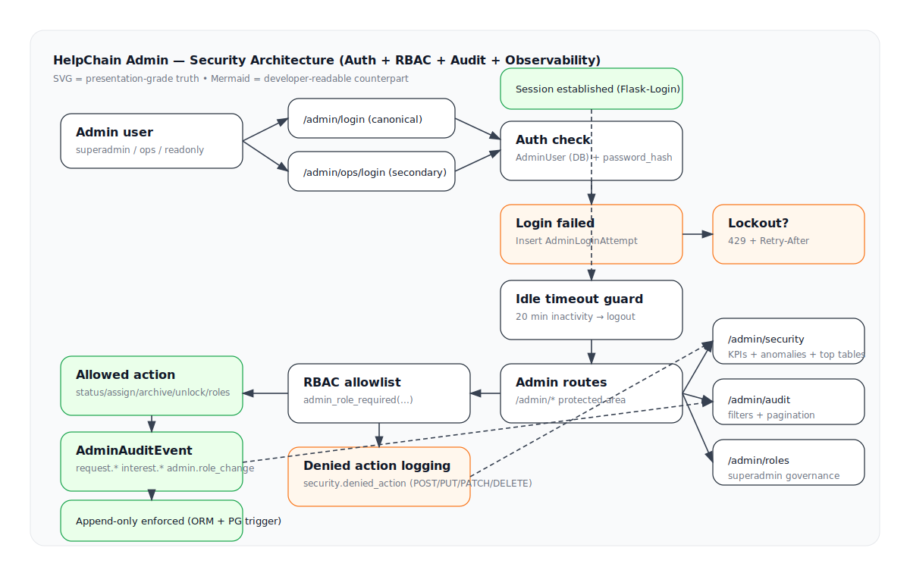
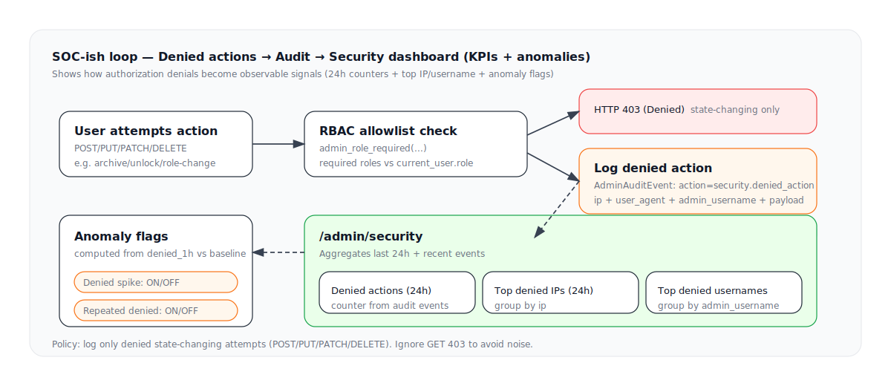

# HelpChain Administrative Security Governance Documentation

Document title: HelpChain Administrative Security Governance Documentation  
Document classification: Internal / Governance  
Scope: Administrative Interface (Application Layer)  
Security review status: Production-ready (Application layer controls)  
Applies to version: v2.x  
Last updated: 2026-03

## Architecture diagrams

### SVG (presentation-grade)



### Auth flow detail (SVG)


### Denied → observability loop (SVG)



### Mermaid (developer-readable)

```mermaid
flowchart TB
U[Admin user] --> L[/admin/login]
U --> L2[/admin/ops/login]
L --> AUTH[Auth check]
L2 --> AUTH
AUTH -->|success| SESS[Session established]
AUTH -->|failed| ATT[Insert AdminLoginAttempt]
ATT --> LOCK{Lockout threshold?}
LOCK -->|yes| RESP429[429 Retry-After]
LOCK -->|no| RESP403[403]
SESS --> GUARD[Idle timeout guard 20m]
GUARD -->|expired| LOGOUT[Logout]
GUARD -->|active| ROUTER[Admin routes]
ROUTER --> RBAC{Role allowlist}
RBAC -->|allowed| ACT[State-changing action]
RBAC -->|denied POST| DENYLOG[Log security.denied_action]
RBAC -->|denied GET| DENYNOISE[403 no audit]
ACT --> AUDIT[Insert AdminAuditEvent]
AUDIT --> APPEND[Append-only (ORM + PG trigger)]
ROUTER --> SECOV[/admin/security]
ROUTER --> AUDPAGE[/admin/audit]
ROUTER --> ROLESPAGE[/admin/roles]
```

### Legend

#### Color semantics

| Color | Meaning |
|---|---|
| 🟢 Light green | Successful / allowed flow (session created, audit inserted, append-only enforced) |
| 🟠 Light orange | Security-relevant signal (login attempt, denied action, lockout logic) |
| 🔴 Light red | Explicit denial or enforcement (403, lockout 429) |
| ⚪ White | Neutral system component (route, guard, RBAC check, dashboard view) |
| 🔵 Light grey background | Context panel / grouped architecture area |

#### Arrow semantics

| Arrow style | Meaning |
|---|---|
| Solid arrow | Direct synchronous flow (request -> check -> response) |
| Dashed arrow | Observability/aggregation path (event -> KPI -> anomaly flag) |
| Arrow to DB | Persistent write (INSERT) |
| Arrow from DB | Read/query for decision logic |

#### Logging policy clarification

`security.denied_action` is logged only for state-changing methods:

- `POST`
- `PUT`
- `PATCH`
- `DELETE`

`GET 403` responses are intentionally ignored to prevent noise.

#### Enforcement layers

| Layer | Purpose |
|---|---|
| Flask route guard | Role allowlist enforcement |
| Idle timeout guard | Session expiration after 20 min inactivity |
| ORM guard | Blocks update/delete on audit table |
| Postgres trigger | DB-level append-only enforcement |

## Executive Summary

The HelpChain admin system is built as a layered security and governance control plane for privileged operations.
It combines strict role enforcement, lockout protection, session controls, immutable audit logging, and UI-level observability.
The design is intentionally fail-closed and traceability-first: privileged actions must be attributable, reviewable, and resilient to tampering.

### Compliance & Governance

#### Compliance Alignment (RGPD / Auditability / Traceability)

The HelpChain Admin Panel has been designed with accountability and traceability principles aligned with European data protection expectations (including RGPD/GDPR-related operational best practices).

While the admin system itself is not a data-processing authority, it enforces the following governance mechanisms:

- Traceability of administrative actions through immutable audit logs
- Attribution of actions to identified operators (username, IP, user agent)
- Separation of duties via role-based access control
- Detection of anomalous or unauthorized attempts (denied action logging, lockout signals)
- Tamper-resistant logging design (append-only enforcement at ORM and database level)

Administrative activity affecting operational records is attributable, reviewable, and preserved in a structured audit trail.

This supports:

- Accountability requirements
- Internal review procedures
- Incident investigation
- Governance transparency

The design favors minimal privilege, explicit authorization, and structured logging over implicit trust.

#### Data Retention Statement

Administrative security telemetry is retained in accordance with operational governance needs.

Current model:

- AdminLoginAttempt: used for lockout logic and security observability
- AdminAuditEvent: append-only operational trace

Recommended retention policy (production guidance):

- Login attempts: 90 days rolling window
- Audit events: minimum 12 months (or aligned with institutional policy)
- Security-denied events: retained alongside audit events

Retention duration may be adjusted depending on:

- Regulatory obligations
- Institutional governance rules
- Incident response requirements

The system design allows retention policies to be enforced at database level (scheduled purge jobs or lifecycle rules), without compromising audit integrity for the active window.

#### Security Responsibility Model

The security posture of the admin system follows a shared responsibility model.

Application Layer (HelpChain)

Responsible for:

- Authentication logic
- Role-based access control enforcement
- Lockout protection
- Session timeout enforcement
- Immutable audit enforcement
- Denied action logging
- Security observability dashboard
- Anomaly detection logic

Infrastructure Layer (Hosting / Platform)

Responsible for:

- HTTPS termination and TLS configuration
- Server-level firewalling
- Network isolation
- Database access control
- Secret management (SECRET_KEY, DB credentials)
- Backup integrity and disaster recovery
- OS-level hardening

Operator Responsibility

Admin users are responsible for:

- Credential confidentiality
- MFA usage where enabled
- Compliance with least-privilege principles
- Reviewing security dashboard signals

#### Governance Posture

The system is designed to:

- Fail closed (deny by default)
- Log privileged behavior
- Prevent log tampering
- Surface misuse patterns early
- Support post-incident reconstruction

The objective is not only to secure the admin interface, but to make privileged activity observable and accountable.

## Security Model

### Threat Model (mini)

#### Assets

- AdminUser accounts (credentials, roles, MFA state)
- AdminAuditEvent (immutable operational history)
- AdminLoginAttempt (authentication telemetry)
- Operational state of Requests (status, owner, archive/unlock)
- Role governance (superadmin / ops / readonly)

#### Primary Threat Categories

1. Brute-force / Credential stuffing
Target: `/admin/login`, `/admin/ops/login`
Mitigations:
- DB-backed login attempt tracking
- Lockout threshold (5 fails / 5 min)
- 429 + Retry-After
- 24h + 1h anomaly detection
- Top IP / username aggregation

2. Privilege escalation (horizontal / vertical)
Target: state-changing admin endpoints
Mitigations:
- Role-based allowlist (superadmin / ops / readonly)
- Explicit deny logging (`security.denied_action`)
- Last superadmin downgrade guard
- Inline role edit restricted to superadmin

3. Insider misuse / unauthorized destructive actions
Target: archive, unlock, role changes
Mitigations:
- Immutable audit trail
- IP + user_agent capture
- Observability via `/admin/security`
- Append-only enforcement (ORM + DB trigger)

4. Log tampering
Target: AdminAuditEvent integrity
Mitigations:
- ORM-level update/delete block
- Postgres trigger blocking UPDATE/DELETE
- Append-only design

5. Session hijacking / stale session reuse
Target: active admin session
Mitigations:
- Idle timeout (20 min inactivity)
- Forced logout on expiry
- Canonical login entrypoint

### Assumptions

- Production runs behind HTTPS.
- SECRET_KEY is stable and securely generated.
- Database credentials are not exposed.
- Only trusted operators receive admin credentials.
- Rate limits are enforced at app level (not relying solely on reverse proxy).
- No direct production DB access for non-privileged operators.
- CSRF protection is enabled for state-changing endpoints.

### Out-of-Scope (Current Version)

- WAF-level IP reputation filtering
- GeoIP anomaly detection
- Distributed rate limiting (Redis-based)
- Hardware-backed MFA enforcement
- Full SIEM integration
- Real-time alert push (email/webhook/Slack)
- Cross-service log correlation
- Device fingerprinting
- Behavioral analytics beyond basic spike detection

### Future Hardening Roadmap

#### Short-term (High ROI)

- Redis-backed distributed rate limiting
- Alert webhook for anomaly spikes
- Admin session binding to IP (optional strict mode)
- Admin login email notification on new IP
- Strong password policy enforcement on role change
- Lockout escalation (progressive delay)

#### Mid-term

- TOTP mandatory for superadmin
- Admin IP allowlist (optional strict mode)
- Signed audit event hash chain (tamper-evident log)
- Structured security event export endpoint
- Alert thresholds configurable via admin UI

#### Long-term (Enterprise-grade)

- Dedicated security dashboard role
- External SIEM export (JSON streaming)
- Immutable log storage mirror (S3 write-once bucket)
- Anomaly scoring model (baseline learning)
- RBAC policy engine abstraction
- Multi-tenant admin isolation

### Security Philosophy

The admin panel is designed as:

- Fail-closed (deny by default)
- Append-only for critical logs
- Observable (security events visible in UI)
- Explicitly role-scoped
- Guarded at both application and database levels

Security controls are layered:

- Route-level enforcement
- Role-level enforcement
- Audit logging
- Immutable storage
- Observability and anomaly detection

## Security Operations & Incident Management

### Incident Response (Administrative Layer)

The HelpChain admin system supports structured post-incident reconstruction through:

- Immutable audit trail (append-only)
- IP and user agent attribution
- Login attempt telemetry
- Denied action logging
- Time-scoped KPI aggregation (24h / 1h windows)

### Incident Workflow (Recommended)

1. Identify anomaly via `/admin/security`
2. Review relevant entries in `/admin/audit`
3. Correlate login attempts and denied actions
4. Validate role and authorization boundaries
5. Apply containment measures:
- Role downgrade (if necessary)
- Credential reset
- Forced logout (session invalidation)
6. Document incident findings

Audit entries are structured to support:

- Timeline reconstruction
- Actor attribution
- Scope determination
- Governance reporting

### Security Event Taxonomy

Administrative security events include:

| Event Type | Source |
|---|---|
| Failed login | AdminLoginAttempt |
| Lockout | Lockout threshold logic |
| security.denied_action | RBAC enforcement |
| request.status_change | Operational state change |
| request.archive | High-risk state change |
| request.unlock | Security-sensitive recovery |
| admin.role_change | Governance modification |

Events are categorized as:

- Authentication-related
- Authorization-related
- Operational state change
- Governance modification

### Security Monitoring Philosophy

The admin system intentionally integrates:

- Preventive controls (RBAC, lockout)
- Detective controls (audit, anomaly flags)
- Forensic capability (append-only log)

Security events are surfaced inside the product, not hidden in backend logs only.

This reduces reliance on external SIEM for basic operational governance.

### Disclosure & Reporting Policy

Security issues affecting the admin panel should be reported to:

- Internal security contact (to be defined)
- Or via structured vulnerability reporting channel

All reported vulnerabilities should be:

- Logged
- Assessed for impact
- Classified by severity
- Resolved with versioned patch
- Documented in security changelog

### Security Versioning & Change Log

The admin panel follows controlled evolution.

Security-relevant changes include:

- Lockout implementation
- Idle session timeout
- Immutable audit enforcement
- Role separation
- Denied action observability
- Governance UI

Each security milestone should be:

- Commit-referenced
- Documented
- Tested
- Version-tagged

### Versioned Security Milestones (Current)

| Milestone | Status |
|---|---|
| DB-backed login lockout | Implemented |
| Idle session timeout | Implemented |
| Append-only audit (ORM + DB trigger) | Implemented |
| RBAC role separation | Implemented |
| Denied action logging | Implemented |
| Security dashboard (24h + anomaly) | Implemented |
| Role governance UI | Implemented |

### Residual Risk Statement

While layered security controls are implemented, residual risk remains in:

- Credential compromise outside the platform
- Infrastructure misconfiguration
- Insider misuse within authorized role boundaries

Risk reduction strategy:

- Strict role separation
- Immutable traceability
- Observability-first design
- Progressive hardening roadmap

### Security Maturity Positioning

Current maturity level:

Application-layer governance with:

- Preventive controls
- Detective monitoring
- Immutable audit
- Structured incident review capability

Next maturity step (enterprise-grade):

- External SIEM export
- Mandatory MFA for superadmin
- Distributed rate limiting
- Alert webhook automation
- Log integrity cryptographic chaining

### Closing Statement

The HelpChain admin system is designed not merely as an operational interface, but as a controlled governance environment.

Security events are attributable, observable, and resistant to tampering.

The objective is institutional trust, operational accountability, and controlled privilege execution.

---

End of document.
